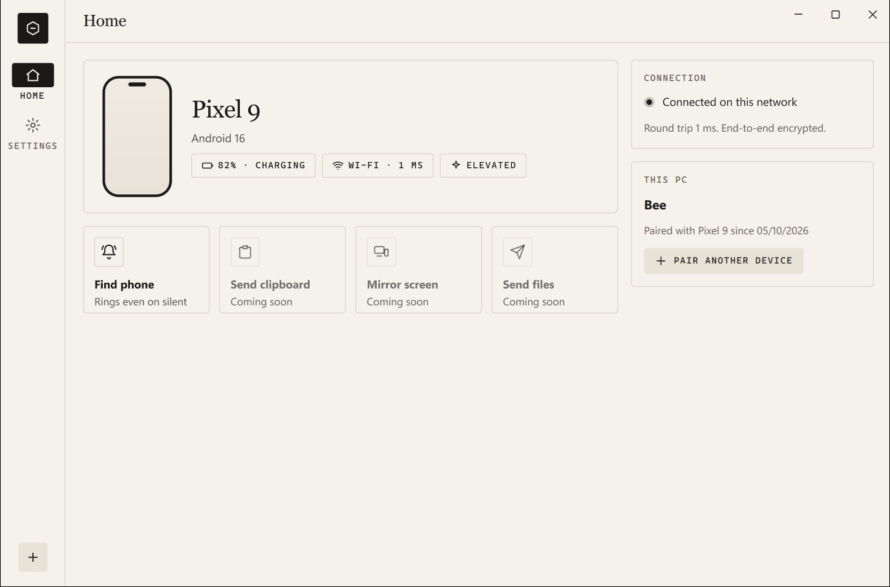
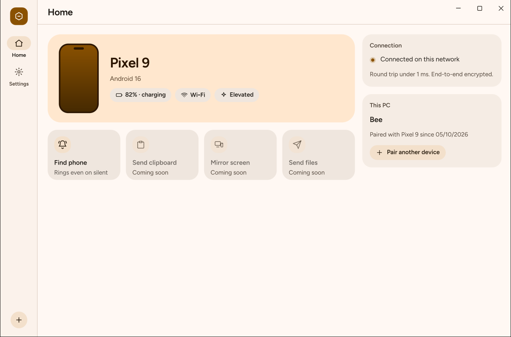
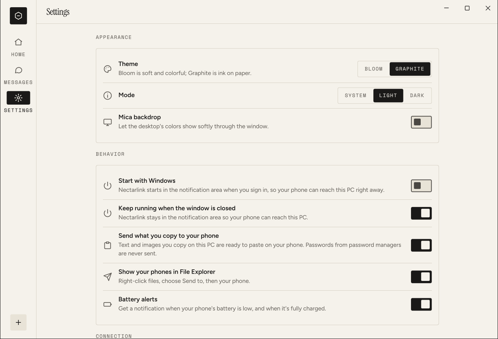
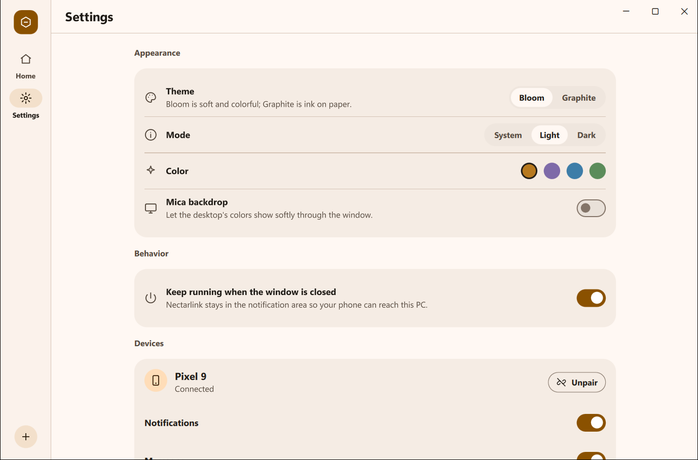
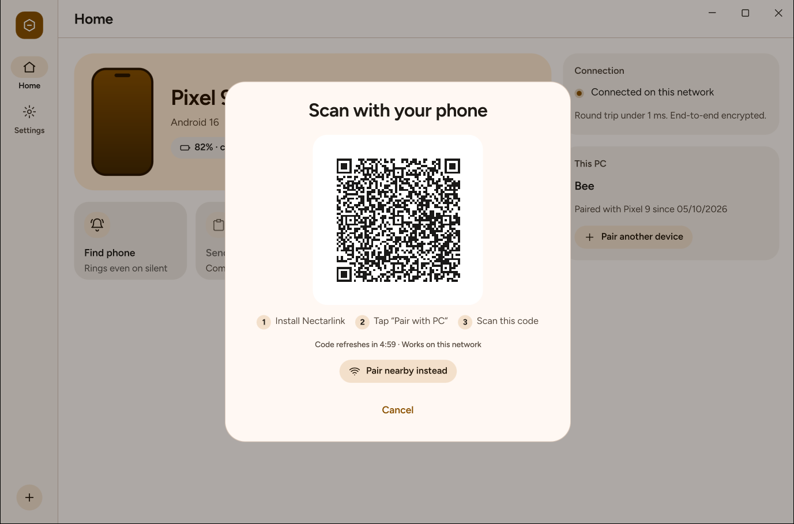

<div align="center">

# Nectarlink

**Your Android phone and your Windows PC, working as one.**

One open-source app for notifications, messages, clipboard, files, screen mirroring
and more between Android and Windows 11. Local-first, end-to-end encrypted,
no account and no cloud.

[](https://github.com/thtbee/nectarlink/actions/workflows/ci.yml)
[](LICENSE)
[](LICENSE)

</div>

> [!IMPORTANT]
> **Nectarlink is in early development.** The foundations work end to end (pairing,
> encrypted connections, live device status, find my device), but most features
> are still ahead. There are no releases yet. See [Project status](#project-status).

<p align="center">
  
</p>

## Why Nectarlink

Connecting an Android phone to a Windows PC today usually means combining
several tools, each covering one part of the job:

| Tool | What it covers | Where it falls short |
|---|---|---|
| Phone Link | Notifications, messages, calls, photos | Needs a Microsoft account; many features depend on the phone brand; little control over what syncs |
| KDE Connect | Notifications, clipboard, files, remote input | The Windows version trails the Linux one; no screen mirroring |
| scrcpy | Screen mirroring and control | Developer setup, command line, no other features |
| LocalSend | File transfer | Files only |
| Intel Unison | Phone integration | Discontinued |

Nectarlink aims to replace all of them with a single app per platform that is
fast, private and pleasant to use:

- **Local-first.** Devices talk directly over your network. Nothing goes through
  a server, and there is no account to create.
- **Encrypted end to end.** Every connection is authenticated with the device keys
  exchanged during pairing.
- **Works with a normal phone.** Everything useful works with ordinary Android
  permissions. An optional one-time setup ("Power Levels", no root) enables
  more, such as background clipboard sync and app windows.
- **Native on both sides.** A Windows 11 app built with Qt Quick and Rust, and an
  Android app built with Jetpack Compose, sharing one Rust core.

The full plan, including research, feature list, architecture and roadmap,
is in [docs/PLAN.md](docs/PLAN.md).

## Project status

Nectarlink is completing **Phase 0: Foundations** of the
[roadmap](docs/PLAN.md#8-roadmap). The pieces every feature builds on are in
place and tested; the user-facing features of Phase 1 come next.

**Working today**

- **Pairing** by scanning a QR code shown on the PC (or opening its pairing link
  with any camera app), or by picking a nearby PC and comparing a 6-digit code.
  Both methods authenticate both devices; a wrong code pairs nothing.
- **Encrypted connections** over the local network (QUIC through
  [iroh](https://iroh.computer)), with automatic reconnection after restarts,
  sleep and network changes.
- **Live status** of each paired device: connection, round-trip time, battery,
  power level.
- **Find my device** in both directions. The phone rings on the alarm stream,
  even in silent mode.
- **Notifications** from the phone on the PC, as Windows notifications and in
  a feed in the app, with the app's icon. Reply inline, run their actions
  (such as "Mark as read") or dismiss them from the PC; what's cleared on one
  side is cleared on the other.
- **Clipboard**: text you copy on the PC is ready to paste on the phone. From
  the phone, send it with the Quick Settings tile, the share sheet or a button
  in the app (Android lets only the app in front read the clipboard).
  Passwords that password managers mark private are never sent.
- **Files** in both directions, at Wi-Fi speed. On the PC, drop files on the
  window, pick them, or right-click them in File Explorer and choose
  **Send to** and your phone (a notification follows the transfer); on the
  phone, share them from any app or pick them in Nectarlink. They land in `Downloads\Nectarlink` on the PC and
  `Download/Nectarlink` on the phone, with progress, cancelling, and transfers
  that pick up where they left off after a dropped connection.
- **Capability matrix**: both apps compute which features work for a pair of
  devices and what would enable the rest, so the interface never offers
  something that can't work.
- **Windows app**: home and settings, two themes in light and dark (Bloom,
  which takes its colors from the desktop wallpaper, and Graphite), Mica, a
  custom title bar with Snap Layouts, and a tray icon. In the background it
  uses about 10 MB of memory (as shown in Task Manager).
- **Android app**: pairing, home and settings, Material You colors, a background
  connection service, and an identity key protected by the Android Keystore.
- **Command-line client** for development and testing (`nectarlink`).

**Next (Phase 1)**: images on the clipboard, media controls, notification
filters and history, and a Windows installer. Mirroring, messages, calls and the other
features in the plan follow in later phases.

## Screenshots

The Windows app has two themes: **Graphite**, ink on paper, and **Bloom**, soft
and colorful. Both come in light and dark.

| Graphite | Bloom |
|:---:|:---:|
|  |  |
|  |  |

<p align="center">
  <br>
  <sub>Pairing a phone: scan the code, or pair nearby with a 6-digit code.</sub>
</p>

<sub>Screenshots are from the current development build. The connected phone is
simulated with the command-line client.</sub>

## How it works

```
 Android app (Kotlin, Compose)            Windows app (Qt Quick, Rust)
          │ UniFFI                                │ cxx-qt
          ▼                                       ▼
 ┌─────────────────────┐   QUIC (iroh),   ┌─────────────────────┐
 │  nectarlink-core    │◄────────────────►│  nectarlink-core    │
 │  pairing, sessions, │  end-to-end      │  pairing, sessions, │
 │  storage, features  │  encrypted       │  storage, features  │
 └─────────────────────┘                  └─────────────────────┘
```

- **One core, two apps.** Protocol, pairing, sessions, the trust store and the
  capability matrix live in Rust (`core/`) and run unchanged on both platforms.
- **Identity.** Each device has an Ed25519 key, encrypted at rest with Windows
  DPAPI or the Android Keystore. Devices are addressed by their public keys.
- **Network.** Local network only by default: discovery over mDNS, direct QUIC
  connections, no relay servers. Away-from-home connections are opt-in.
- **Protocol.** Versioned and documented in [docs/protocol/v0.md](docs/protocol/v0.md):
  length-prefixed CBOR messages on QUIC streams.

## Repository layout

```
core/
  nectarlink-protocol/   Message types, framing, pairing cryptography      (MPL-2.0)
  nectarlink-core/       Identity, trust store, pairing, sessions, features (MPL-2.0)
  nectarlink-ffi/        UniFFI bindings used by the Android app          (MPL-2.0)
  nectarlink-cli/        Command-line client for development and testing   (GPL)
desktop/app/             Windows app: Rust host, cxx-qt bridge, QML UI     (GPL)
android/                 Android app: Kotlin and Jetpack Compose           (GPL)
assets/fonts/            Fonts both apps ship with                         (OFL-1.1)
tools/xtask/             Code generation (theme tokens) and checks
spikes/                  Technical experiments with their results
scripts/                 Build and check scripts
docs/                    Plan, decision records, protocol, design system   (CC BY 4.0)
```

## Building

Nectarlink is not ready for everyday use; these steps are for development.

**Requirements**

| Part | Needs |
|---|---|
| Core and CLI | [Rust](https://rustup.rs) (stable, pinned in `rust-toolchain.toml`) |
| Windows app | Windows 11, Visual Studio 2022 Build Tools (C++), [Qt 6.12](https://www.qt.io/download-open-source) for MSVC 2022 x64 |
| Android app | Android SDK (platform 37, NDK 30.0.16248370), JDK 17 or newer, `cargo-ndk` (see [android/README.md](android/README.md)) |

**Core, CLI and tests**

```sh
cargo test -p nectarlink-protocol -p nectarlink-core -p nectarlink-ffi
cargo run -p nectarlink-cli -- --help
```

**Windows app** (with Qt's `bin` folder on `PATH`, or `QMAKE` pointing to its `qmake`)

```sh
cargo run -p nectarlink-desktop
```

**Android app**

```sh
cd android
./gradlew assembleDebug
```

**All checks** (formatting, lints, tests, license headers, generated files,
dependency policy), as CI runs them:

```powershell
./scripts/check.ps1            # add -Android and -Arm64 for the full set
```

## Documentation

- [Project plan](docs/PLAN.md): research, features, architecture, roadmap
- [Protocol v0](docs/protocol/v0.md) and the [capability registry](docs/protocol/capabilities.md)
- [Architecture decision records](docs/adr)
- [Capability matrix](docs/architecture/capabilities.md) and the [core API](docs/architecture/core-api.md)
- [Design system](docs/design/README.md)
- [Qt + Rust feasibility results](spikes/s1-qt-rust/README.md)

## Contributing

Contributions are welcome. Please read [CONTRIBUTING.md](CONTRIBUTING.md) first;
for anything larger than a small fix, open an issue to agree on the approach.
Contributions are accepted under the [Developer Certificate of Origin](DCO.txt),
and everyone is expected to follow the [Code of Conduct](CODE_OF_CONDUCT.md).

To report a security issue, follow [SECURITY.md](SECURITY.md). Please don't
open a public issue.

## License

- Windows and Android apps, CLI: [GPL-3.0-or-later](LICENSES/GPL-3.0-or-later.txt),
  with an [app-store exception](LICENSES/APP-STORE-EXCEPTION.md)
- Core libraries: [MPL-2.0](LICENSES/MPL-2.0.txt)
- Protocol specification and documentation: [CC BY 4.0](LICENSES/CC-BY-4.0.txt)

See [LICENSE](LICENSE) for which license applies where. The Nectarlink name and
logo are covered by the [trademark policy](TRADEMARKS.md).
