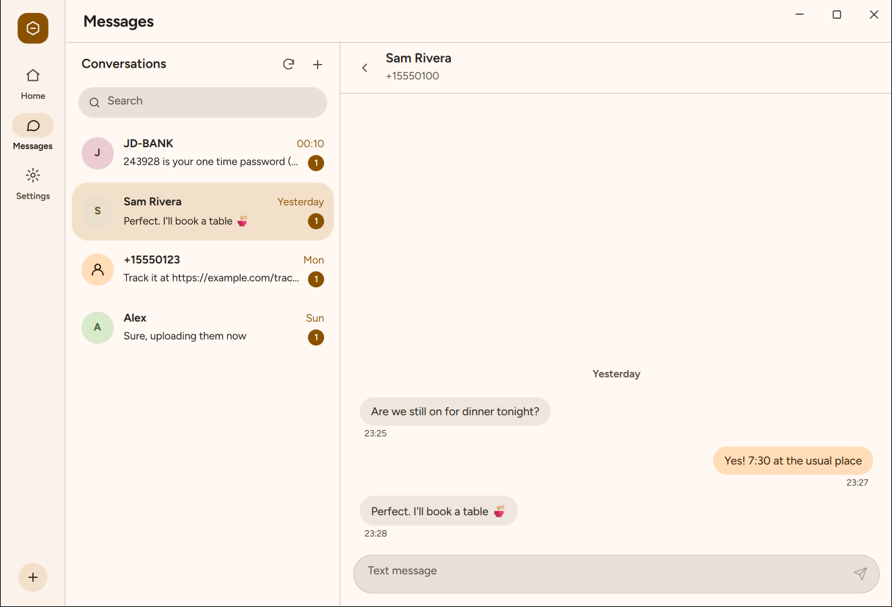
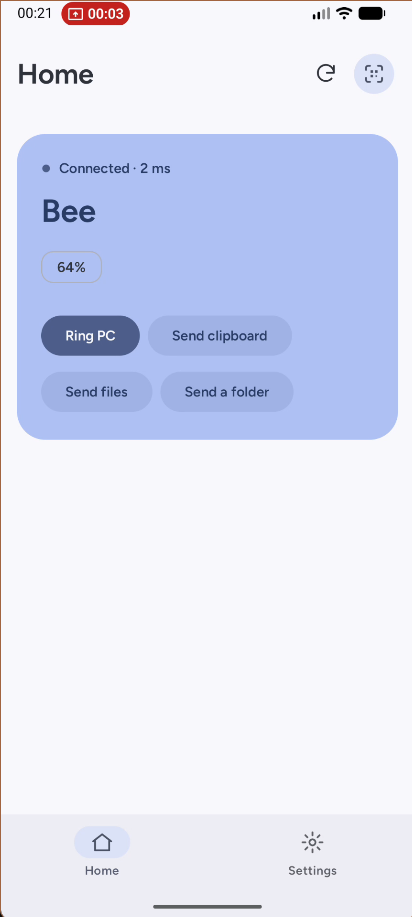

<div align="center">

# Nectarlink

**Your Android phone and your Windows PC, working as one.**

One open-source app for notifications, messages, clipboard, files, screen mirroring
and more between Android and Windows 11. Local-first, end-to-end encrypted,
no account and no cloud.

[](https://github.com/thtbee/nectarlink/actions/workflows/ci.yml)
[](LICENSE)
[](LICENSE)

</div>

> [!IMPORTANT]
> **Nectarlink is in active development.** The everyday features work end to end
> (notifications, clipboard, files, media) and mirroring, messages and calls are
> well along, but there are no releases yet. See [Project status](#project-status).

<p align="center">
  
</p>

## Why Nectarlink

Connecting an Android phone to a Windows PC today usually means combining
several tools, each covering one part of the job:

| Tool | What it covers | Where it falls short |
|---|---|---|
| Phone Link | Notifications, messages, calls, photos | Needs a Microsoft account; many features depend on the phone brand; little control over what syncs |
| KDE Connect | Notifications, clipboard, files, remote input | The Windows version trails the Linux one; no screen mirroring |
| scrcpy | Screen mirroring and control | Developer setup, command line, no other features |
| LocalSend | File transfer | Files only |
| Intel Unison | Phone integration | Discontinued |

Nectarlink aims to replace all of them with a single app per platform that is
fast, private and pleasant to use:

- **Local-first.** Devices talk directly over your network. Nothing goes through
  a server, and there is no account to create.
- **Encrypted end to end.** Every connection is authenticated with the device keys
  exchanged during pairing.
- **Works with a normal phone.** Everything useful works with ordinary Android
  permissions. An optional one-time setup ("Power Levels", no root) enables
  more, such as background clipboard sync and app windows.
- **Native on both sides.** A Windows 11 app built with Qt Quick and Rust, and an
  Android app built with Jetpack Compose, sharing one Rust core.

The full plan, including research, feature list, architecture and roadmap,
is in [docs/PLAN.md](docs/PLAN.md).

## Project status

Nectarlink has finished **Phase 1** of the [roadmap](docs/PLAN.md#8-roadmap)
(the everyday features) and is working through **Phase 2** (mirroring,
messages and calls). Everything below works end to end and is covered by
tests; there are no releases yet.

**Working today**

- **Pairing** by scanning a QR code shown on the PC (or opening its pairing link
  with any camera app), or by picking a nearby PC and comparing a 6-digit code.
  Both methods authenticate both devices; a wrong code pairs nothing.
- **Encrypted connections** over the local network (QUIC through
  [iroh](https://iroh.computer)), with automatic reconnection after restarts,
  sleep and network changes.
- **Live status** of each paired device: connection, round-trip time, battery,
  power level.
- **Find my device** in both directions. The phone rings on the alarm stream,
  even in silent mode.
- **Lock, sleep or wake the PC** from the phone (when the PC is offline, Wake
  sends Wake-on-LAN magic packets to its stored network addresses, and the PC's
  Settings shows whether its adapter has Wake on Magic Packet turned on), and
  **links** both ways: share a link from any phone app to open it on the PC, or
  send a copied link from the PC's tray to the phone.
- **Notifications** from the phone on the PC, as Windows notifications and in
  a feed in the app, with the app's icon. Reply inline, run their actions
  (such as "Mark as read") or dismiss them from the PC; what's cleared on one
  side is cleared on the other. Photos in messages and big pictures come
  along. Per app, choose whether they pop up, show only in the app, or stay
  hidden, and find the last day's notifications in History.
- **Clipboard**: text and images you copy on the PC are ready to paste on the
  phone. From the phone, send them with the Quick Settings tile, the share
  sheet or a button in the app (Android lets only the app in front read the
  clipboard). Passwords that password managers mark private are never sent.
- **Files and folders** in both directions, at Wi-Fi speed. On the PC, drop
  them on the window, pick them, or right-click them in File Explorer and
  choose **Send to** and your phone (a notification follows the transfer);
  on the phone, share them from any app or pick them in Nectarlink. They land in `Downloads\Nectarlink` on the PC and
  `Download/Nectarlink` on the phone, with progress, cancelling, and transfers
  that pick up where they left off after a dropped connection.
- **Screen mirroring**: see the phone's screen on the PC, in a window of
  its own, at up to 1920 pixels and 60 frames a second, hardware encoded on
  the phone, with the phone's sound playing on the PC (Android 10 and
  later; mute it from the window); Android asks each time. Turn on
  **Control from your PC** in
  the phone's Nectarlink settings to tap, swipe, scroll and type with the
  PC's mouse and keyboard (right-click is Back), or set up **Wireless
  debugging** there once for real touch (live dragging) and keys, with
  nothing else to install; Nectarlink turns Wireless debugging back on by
  itself after a reboot.
- **Phone apps in windows** on the PC: with Wireless debugging set up
  (Android 11 and later), pick any of the phone's apps (with a Recent row
  for the ones opened most recently) and it opens in a window of its own with
  its own taskbar icon, running on the phone beside whatever its screen shows
  and without popping the phone's keyboard up on its screen; resize the
  window and the app re-lays out to fit, its size and position are remembered
  for next time, and if it closes on the phone the window offers to open it
  again.
- **Texts** on the PC: a Messages page with the phone's conversations
  (pictures included), to reply or start a new one (searching contacts as
  you type); texts go out through the phone. Search them, copy a one-time
  code with one click, and open links.
- **Calls and contacts**: a Calls page with the phone's recent calls
  (grouped by day, missed calls marked, tap to call back or text), its
  contacts (favorites first, with photos and search), and a keypad to call
  any number from the PC through the phone. When the phone rings, see who's
  calling on the PC (with the contact's name and photo), and answer, decline
  or silence it from there. During the call, the PC shows how long it has
  been going and can hang up and change the volume; with Wireless debugging
  set up (Android 12 and later), also mute, switch to the speaker, hold and
  use the keypad. The call's audio stays on the phone. Calls nobody answered
  show as missed.
- **Photos and videos**: a Photos page on the PC with the phone's camera roll,
  screenshots and albums, grouped by day. View photos in the app (with arrow
  keys between them), open them in Windows Photos, copy a photo to the
  clipboard, or save one or many to a folder you pick (`Downloads\Nectarlink`
  by default). New photos and screenshots from the phone also pop up on the PC
  with a preview, ready to save or copy.
- **Touchpad, air mouse, keyboard, voice typing and presentation remote**:
  control the PC from the phone — a touchpad with one-finger move, tap to
  click, two-finger tap for right-click, two-finger scroll,
  double-tap-and-hold drag and adjustable speed; an **air mouse** where holding
  the pad and tilting the phone moves the PC cursor with its gyroscope (with
  hand-tremor filtering, smoothing and tap-to-click); **voice typing** with a
  **Dictate** button (tap or hold to talk) that uses the phone's speech
  recognizer (on-device where available) with live partial results and types
  into the PC's focused field; soft-keyboard typing with a bar of modifier and
  special keys (`Ctrl`, `Alt`, `Shift`, `Win`, `Esc`, `Tab`, arrows,
  `Home`/`End`, `PgUp`/`PgDn`, `Del` and shortcuts); and a presentation mode
  with Next/Previous slide (plus the phone's volume buttons while open),
  Start/End show, Black screen, and a hold-for-laser pointer that draws an
  accent-colored dot on the PC screen following the phone's gyroscope or
  finger. Off by default on the PC, with a one-time prompt the first time a
  phone asks and a per-phone toggle in Settings.
- **Voice recorder**: record with the phone's microphone (with a live level
  meter, pause and resume, timestamped markers, and recording that keeps going
  when the screen turns off) and send it straight to the PC. On the PC it lands
  in the folder and format you choose (`Downloads\Nectarlink` and M4A by
  default, or MP3, WAV or FLAC converted on the PC), with a `.markers.txt`
  file beside it when you add markers and a notification to open the recording
  or its folder. If the PC is offline, the recording waits on the phone and
  goes out as soon as it reconnects.
- **Phone controls on the PC**: see and change the phone's Do Not Disturb,
  ringer mode (Ring, Vibrate, Silent), flashlight, media volume, screen
  brightness, Wi‑Fi (with a confirmation before turning it off) and Bluetooth
  from the PC's Home screen. Volume, Ring/Vibrate and the
  flashlight work out of the box; Do Not Disturb and silent mode use
  Notification Policy Access; screen brightness uses Modify system settings;
  and Wi‑Fi and Bluetooth unlock with Wireless debugging (which also
  grants the Do Not Disturb and brightness permissions automatically).
- **Media** both ways: what plays on the phone shows on the PC, in the app and
  in Windows' own media flyout (so the keyboard's media keys work too), and
  what plays on the PC shows in the phone's media controls, with artwork and
  a seek bar.
- **Battery alerts** on the PC when the phone runs low or is fully charged.
  Phone notifications follow Windows' Do not disturb (they wait in the app).
- **Capability matrix**: both apps compute which features work for a pair of
  devices and what would enable the rest, so the interface never offers
  something that can't work.
- **Windows app**: home, messages, calls, photos and settings, two themes in light and dark (Bloom,
  which takes its colors from the desktop wallpaper, and Graphite), Mica, a
  custom title bar with Snap Layouts, and a tray icon. In the background it
  uses about 10 MB of memory (as shown in Task Manager).
- **Android app**: pairing, home and settings, Material You colors, a background
  connection service, and an identity key protected by the Android Keystore.
- **Connection Doctor** on the PC: finds what keeps the phone from
  connecting (firewall, a public network, a VPN) and fixes what it can.
- **Windows installer**: installs for everyone on the PC, allows the app
  through Windows Firewall, starts it with Windows, and uninstalls cleanly.
  Each `v*` tag drafts a GitHub release with the installer and the signed
  Android app; both apps update themselves from published releases, checked
  against their SHA-256 sums.
- **Command-line client** for development and testing (`nectarlink`).

**Next**: talking on calls through the PC (Bluetooth), and the rest of the
[plan](docs/PLAN.md).

## Screenshots

The Windows app has two themes: **Graphite**, ink on paper, and **Bloom**, soft
and colorful. Both come in light and dark.

| Graphite | Bloom |
|:---:|:---:|
|  |  |
|  |  |

<p align="center">
  
  <br>
  <sub>The phone's texts on the PC, and its screen in a window of its own.</sub>
</p>

<p align="center">
  <br>
  <sub>Pairing a phone: scan the code, or pair nearby with a 6-digit code.</sub>
</p>

<sub>Screenshots are from the current development build. The connected phone is
simulated with the command-line client (`nectarlink --as-phone demo`); the
mirrored screen is the Android app on an emulator.</sub>

## How it works

```
 Android app (Kotlin, Compose)            Windows app (Qt Quick, Rust)
          │ UniFFI                                │ cxx-qt
          ▼                                       ▼
 ┌─────────────────────┐   QUIC (iroh),   ┌─────────────────────┐
 │  nectarlink-core    │◄────────────────►│  nectarlink-core    │
 │  pairing, sessions, │  end-to-end      │  pairing, sessions, │
 │  storage, features  │  encrypted       │  storage, features  │
 └─────────────────────┘                  └─────────────────────┘
```

- **One core, two apps.** Protocol, pairing, sessions, the trust store and the
  capability matrix live in Rust (`core/`) and run unchanged on both platforms.
- **Identity.** Each device has an Ed25519 key, encrypted at rest with Windows
  DPAPI or the Android Keystore. Devices are addressed by their public keys.
- **Network.** Local network only by default: discovery over mDNS, direct QUIC
  connections, no relay servers. Away-from-home connections are opt-in.
- **Protocol.** Versioned and documented in [docs/protocol/v0.md](docs/protocol/v0.md):
  length-prefixed CBOR messages on QUIC streams.

## Repository layout

```
core/
  nectarlink-protocol/   Message types, framing, pairing cryptography      (MPL-2.0)
  nectarlink-core/       Identity, trust store, pairing, sessions, features (MPL-2.0)
  nectarlink-ffi/        UniFFI bindings used by the Android app          (MPL-2.0)
  nectarlink-cli/        Command-line client for development and testing   (GPL)
desktop/app/             Windows app: Rust host, cxx-qt bridge, QML UI     (GPL)
android/                 Android app: Kotlin and Jetpack Compose           (GPL)
assets/fonts/            Fonts both apps ship with                         (OFL-1.1)
tools/xtask/             Code generation (theme tokens) and checks
spikes/                  Technical experiments with their results
scripts/                 Build and check scripts
docs/                    Plan, decision records, protocol, design system   (CC BY 4.0)
```

## Building

Nectarlink is not ready for everyday use; these steps are for development.

**Requirements**

| Part | Needs |
|---|---|
| Core and CLI | [Rust](https://rustup.rs) (stable, pinned in `rust-toolchain.toml`) |
| Windows app | Windows 11, Visual Studio 2022 Build Tools (C++), [Qt 6.12](https://www.qt.io/download-open-source) for MSVC 2022 x64 |
| Android app | Android SDK (platform 37, NDK 30.0.16248370), JDK 17 or newer, `cargo-ndk` (see [android/README.md](android/README.md)) |

**Core, CLI and tests**

```sh
cargo test -p nectarlink-protocol -p nectarlink-core -p nectarlink-ffi
cargo run -p nectarlink-cli -- --help
```

**Windows app** (with Qt's `bin` folder on `PATH`, or `QMAKE` pointing to its `qmake`)

```sh
cargo run -p nectarlink-desktop
```

**Android app**

```sh
cd android
./gradlew assembleDebug
```

**Windows installer** (with [NSIS](https://nsis.sourceforge.io) installed)

```powershell
./scripts/package.ps1             # target\package\Nectarlink-<version>-x64-setup.exe
./scripts/package.ps1 -StageOnly  # just the app folder, as it ships
```

**All checks** (formatting, lints, tests, license headers, generated files,
dependency policy), as CI runs them:

```powershell
./scripts/check.ps1            # add -Android and -Arm64 for the full set
```

## Documentation

- [Project plan](docs/PLAN.md): research, features, architecture, roadmap
- [Protocol v0](docs/protocol/v0.md) and the [capability registry](docs/protocol/capabilities.md)
- [Architecture decision records](docs/adr)
- [Capability matrix](docs/architecture/capabilities.md) and the [core API](docs/architecture/core-api.md)
- [Design system](docs/design/README.md)
- [Qt + Rust feasibility results](spikes/s1-qt-rust/README.md)

## Contributing

Contributions are welcome. Please read [CONTRIBUTING.md](CONTRIBUTING.md) first;
for anything larger than a small fix, open an issue to agree on the approach.
Contributions are accepted under the [Developer Certificate of Origin](DCO.txt),
and everyone is expected to follow the [Code of Conduct](CODE_OF_CONDUCT.md).

To report a security issue, follow [SECURITY.md](SECURITY.md). Please don't
open a public issue.

## License

- Windows and Android apps, CLI: [GPL-3.0-or-later](LICENSES/GPL-3.0-or-later.txt),
  with an [app-store exception](LICENSES/APP-STORE-EXCEPTION.md)
- Core libraries: [MPL-2.0](LICENSES/MPL-2.0.txt)
- Protocol specification and documentation: [CC BY 4.0](LICENSES/CC-BY-4.0.txt)

See [LICENSE](LICENSE) for which license applies where. The Nectarlink name and
logo are covered by the [trademark policy](TRADEMARKS.md).
